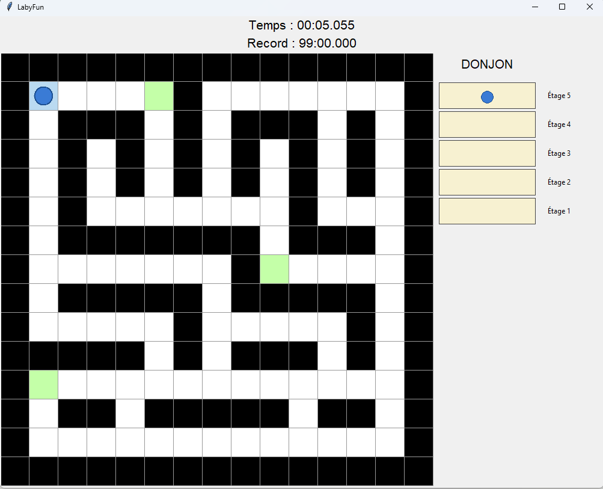
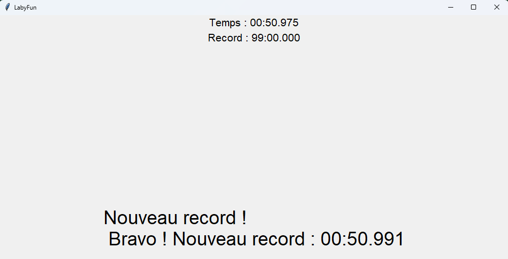

# Dungeon Escape Game
*A Python game where you escape a dungeon by solving mazes.*
Game French name : "Labyfun"

## 🎮 Screenshot

## Context of the project
Two fellow fourth-year engineering students and I created a video game as part of a "Python Application Development" course.

The goal is to escape a dungeon by solving 5 maze levels.
- Player: Blue circle (controlled with arrow keys).
- Traps: Green cells (some help you progress, others waste your time).
- Goal: Find the correct exit on each floor to descend and escape!

## How to Play
1. Download the repository:
   - Click on the green **"Code"** button → **"Download ZIP"**.
   - Extract the folder.

2. Run the game:
   - Open a terminal in the project folder.
   - Run: "python main.py"

##  Project Structure
| File | Description |
 
| `Carte.py` | Handles the map files and converts them into matrices for display. |

| `Position.py` | Manages position logic (e.g., for traps). |

| `Game_Manager.py` | Controls game execution, timer, and level transitions. |

| `laby_Affichage.py` | Tkinter class for graphical display. |

| `main.py` | Launches the game. |

| `record.txt` | Stores the best escape time. |

| `carte1.txt` to `carte5.txt` | Maze maps (0 = path, -1 = wall). |

## Features
- Timer: Tracks your escape time.
- Record System: Updates `record.txt` if you beat the previous best time.
- 5 Levels: Each floor has a unique maze to solve.

## Technologies Used
- **Language**: Python
- **Libraries**: Tkinter (for GUI)
- **Tools**: Git, GitHub

## 🤝 **Contributors**
- [@Tmarielarramendy](https://github.com/marielarramendy)
- @Oscar Giret-Lauret
- @Romain Gaildraud
